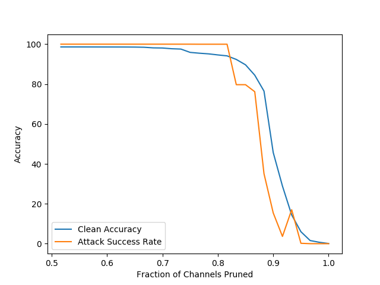

# [Lab 3](https://github.com/ronnyyu/CSAW-HackML-2020/tree/master/lab3)

```bash
├── data 
    └── cl
        └── valid.h5 // this is clean validation data used to design the defense
        └── test.h5  // this is clean test data used to evaluate the BadNet
    └── bd
        └── bd_valid.h5 // this is sunglasses poisoned validation data
        └── bd_test.h5  // this is sunglasses poisoned test data
├── models
    └── bd_net.h5
    └── bd_weights.h5
    └── b_prime_model_0.02.h5
    └── b_prime_model_0.04.h5
    └── b_prime_model_0.10.h5
├── architecture.py
└── eval.py // this is the evaluation script
```

## I. Dependencies
> You may use pip install -r requirements.txt to install all the dependencies below.
   1. Python 3.6.9
   2. Keras 2.3.1
   3. Numpy 1.16.3
   4. Matplotlib 2.2.2
   5. H5py 2.9.0
   6. TensorFlow-gpu 1.15.2 / tensorflow 2.1.4
   7. Sklearn
   8. cv2

## II. Getting Started
Pruning: 
1. Download the validation and test datasets from [here](https://drive.google.com/drive/folders/1Rs68uH8Xqa4j6UxG53wzD0uyI8347dSq?usp=sharing) and store them under `data/` directory.
2. conda create ml-lab3-py36 python=3.6.9
3. conda activate ml-lab3-py36
4. cd lab3 && pip install -r requirements.txt
5. python main.py

Evaluating:
1. python eval.py <bd_model_file> <b_prime_model_file> <image_file>
  
   By default, we use the pretrained models (bd_net.h5 and b_prime_model_0.02.h5) and the first image of the bd_test.h5.


## III. Report
1. Accuracy Image:

   
2. Please also report attack success rate for X=30%

   15.41
   
3. Finally, in your report, also comment on whether the pruning defense works for this model? If not, why not?
   
   From the accuracy image we know that the clean accuracy is close to attack success rate, which means the pruning defense doesn't work very well for this model. That may be caused by aware-attack and we delete some valid neurons. And I think it would be better if we could try to use file-pruning defense. 

## IV. Problems and Solutions
1. **import matplotlib error**

   RuntimeError: Python is not installed as a framework. The Mac OS X backend will not be able to function correctly if Python is not installed as a framework. See the Python documentation for more information on installing Python as a framework on Mac OS X. Please either reinstall Python as a framework, or try one of the other backends. If you are using (Ana)Conda please install python.app and replace the use of 'python' with 'pythonw'. See 'Working with Matplotlib on OSX' in the Matplotlib FAQ for more information.
   
   Solution: add `backend: TkAgg` into `~/.matplotlib/matplotlibrc`.


## V. Reference
1. [Stackoverflow: How to add and remove new layers in keras after loading weights?](https://stackoverflow.com/questions/41668813/how-to-add-and-remove-new-layers-in-keras-after-loading-weights)
2. [Stackoverflow: RuntimeError: Python is not installed as a framework](https://stackoverflow.com/questions/34977388/matplotlib-runtimeerror-python-is-not-installed-as-a-framework)

